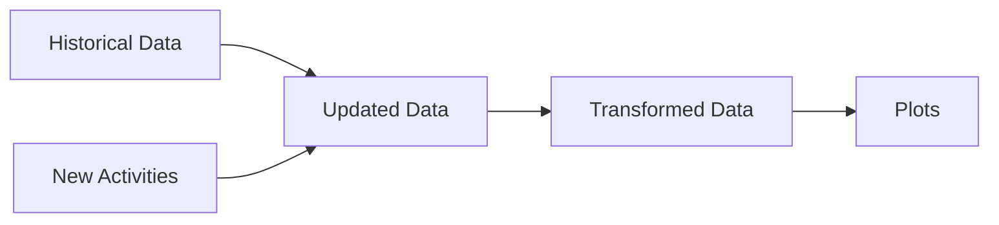

# Time_Management
> Goals are good for setting a direction, but systems are best for making progress.

This repo is designed to track my time management in these 3 areas: **work, development, and self-care**. I want to make sure I invest a bit in each of these 3 areas everyday for a good habit formation. 

## 01_How does it work?
I set up an expecation for the current monitoring period (outlined [here](https://github.com/krystinli/Time_Management/blob/main/run.py#L69-L75)) and then update hours spent with my actual performance of the day. The embedded logic computes a performance rating by comparing my goal vs. my actual performance. A positive rating means I'm hitting the target; a negative rating means I did not. 
- **Performance rating:** `Performance = Expected Hours - Actual Hours`
- **Overall goal:** To meet my target consistenly 📈

## 02_Trends 
**Look back period:** 20 days  

**Total hours** 🎯 spent in all 3 categories: this is an aggregated indicator of my overall performance

### Work-Work 💻 - Work related tasks completion
Meetings and plannings don't count 👀. The idea is actually getting something done ✅

### Development 🌳 - Investing in my growth
Personal projects, time spent on learnings outside of work 📚, and financial growth 💰

### Self-Care 💟 - Prioritize my well-being
Exercising, meditation, planning, etc. 🏡 🏃‍♀️ 

## 03_Breakdown
Additional tracking for this month [here](https://github.com/krystinli/Time_Management/tree/main/Breakdown_Analysis).

### Workout 🏋️‍♀️

## 04_Pipeline
How are these plots generated? 📊

