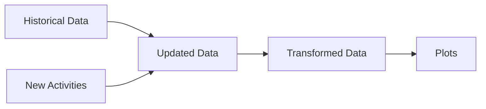

# Time_Management
> Goals are good for setting a direction, but systems are best for making progress.

This repo is designed to track my time management in these 3 areas: **work, development, and self-care**. A good balance in these 3 areas can help achiving the most optimal outcome. Once you understand that habits can change, you have the freedom and the responsibility to remake them.

## 01_How does it work?
I set up an expecation for the current monitoring period (outlined [here](https://github.com/krystinli/Time_Management/blob/main/run.py#L77-L86)) and then update hours spent with my actual performance of the day. The embedded logic computes a performance rating by comparing my goal vs. my actual performance. A positive rating means I'm hitting the target; a negative rating means I did not. 

Every once a while I looked at my performance in the past 2 weeks and month over month, and adjust my behaviour or my expectation accordingly. 
- **Performance rating:** `Performance = Expected Hours - Actual Hours`
- **Overall goal:** To meet my target consistenly 📈

## 02_Trends 

### Total hours 📊
Sum of all 3 categories: this is an aggregated indicator of my overall performance

### Work-Work 💻 - Work related tasks completion
Meetings and plannings don't count 👀. The idea is actually getting something done ✅

### Development 🌳 - Investing in my growth
Personal projects, time spent on learnings outside of work 📚, and financial growth 💰

### Self-Care 💟 - Prioritize my well-being
Exercising, meditation, planning, etc. 🏡 🏃‍♀️ 

## 03_Monthly_Trends

## 04_Pipeline
How are these plots generated? 📊

