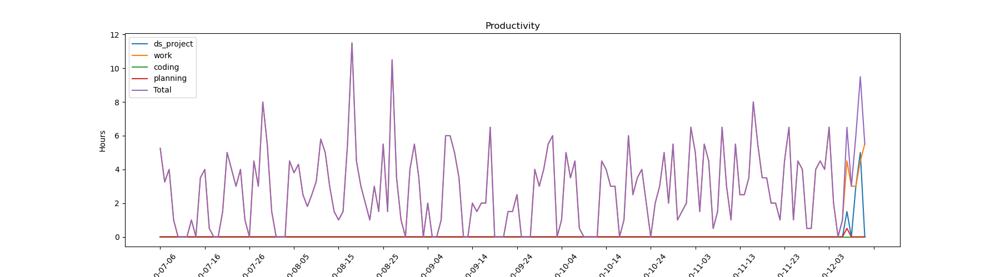

# Time_Management
track my hours spent in different categories

### Categories
1. `work` Work Coding and Analysis
2. `ds_project` DS side Project or Theory Based Reading
3. `coding` Coding Exercise (like Leetcode, Hackerank, etc.)
4. `planning` Agile, Blogging, Career/Finance Planning 
